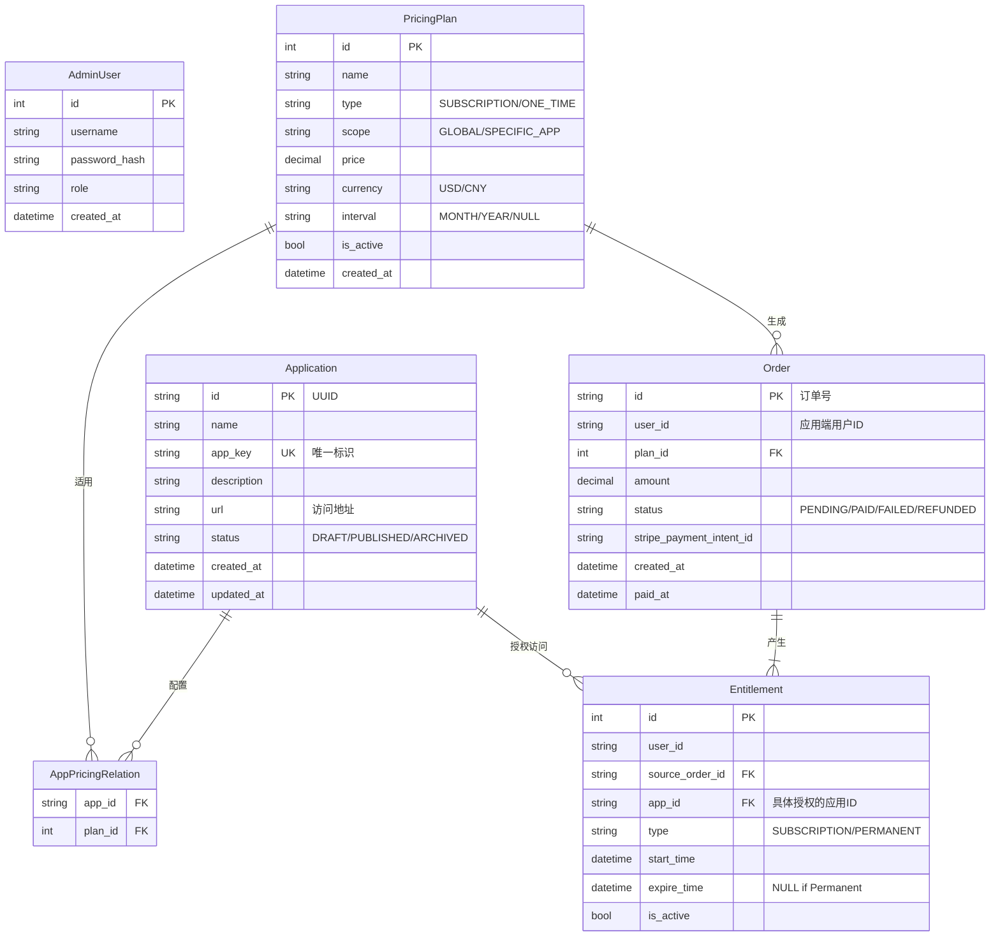

# 管理端技术设计文档 (Admin Portal)

## 1. 概述
本系统作为 Web 应用分发与计费平台的管理后台，主要服务于公司内部管理员。核心功能包括应用管理、收费策略配置、订单与收入概览。设计重点在于数据的完整性管理和灵活的计费模型配置。

## 2. 前端架构设计

### 2.1 技术栈建议
- **框架**: React + TypeScript
- **构建工具**: Vite
- **UI 组件库**: Ant Design (适合中后台复杂表单与数据展示)
- **状态管理**: Zustand 或 React Query (用于服务端状态同步)
- **路由**: React Router

### 2.2 核心模块划分
1.  **应用管理模块 (App Management)**
    *   **页面**: 应用列表页、应用详情/编辑页、新建应用向导。
    *   **功能**: 支持应用的增删改查，管理 `AppKey` 生成，应用状态流转（草稿->上架->下架）。
2.  **计费配置模块 (Pricing Configuration)**
    *   **页面**: 收费项目列表、创建/编辑收费策略。
    *   **功能**: 
        *   支持创建订阅和一次性购买两种类型
        *   **应用关联灵活性**: 不选应用 = 全局访问权限；选择应用 = 限定应用访问
        *   动态表单：订阅类型显示计费周期选项（月/季/年）
3.  **运营中心 (Dashboard & Orders)**
    *   **页面**: 总览看板、订单流水查询。
    *   **功能**: 数据可视化展示（ECharts/ReCharts），订单的多维度筛选（按应用、按时间、按状态）。

### 2.3 关键交互设计
*   **收费项目绑定**: 在应用编辑页，提供“关联收费项目”的穿梭框或多选组件，确保应用与收费策略的强关联。

## 3. 后端架构设计

### 3.1 数据库设计 (ER 图)

### 3.2  핵심业务逻辑 (Core Logic)
1.  **收费策略关联校验**:
    *   创建 `PricingPlan` 时，如果 `scope` 为 `SPECIFIC_APP`，必须校验关联的 `App ID` 列表。
    *   不允许删除已被购买且在有效期内的收费项目，只能将其状态设为 `Disabled`。
2.  **应用状态流转**:
    *   `DRAFT` (草稿): 仅管理员可见，不可被前台购买。
    *   `PUBLISHED` (上架): 用户端可见，可购买。
    *   `ARCHIVED` (下架): 用户端不可见，已购买用户（永久）或在订阅期内用户仍可使用。

## 4. API 接口设计 (管理端)

> 所有接口需携带 `Authorization: Bearer <AdminToken>`

### 4.1 应用管理

| 方法 | 路径 | 描述 | 参数示例 |
| :--- | :--- | :--- | :--- |
| GET | `/api/admin/apps` | 获取应用列表 | `?status=PUBLISHED&page=1` |
| POST | `/api/admin/apps` | 创建应用 | `{ "name": "App1", "url": "...", "appKey": "auto-gen" }` |
| PUT | `/api/admin/apps/:id` | 更新应用 | `{ "status": "PUBLISHED", "pricePlanIds": [1, 2] }` |
| DELETE | `/api/admin/apps/:id` | 软删除/下架应用 | - |

### 4.2 收费项目管理

| 方法 | 路径 | 描述 | 参数示例 |
| :--- | :--- | :--- | :--- |
| GET | `/api/admin/plans` | 获取收费项目列表 | `?type=SUBSCRIPTION` |
| POST | `/api/admin/plans` | 创建收费项目 | `{ "name": "Pro Monthly", "type": "SUBSCRIPTION", "price": 9.99, "interval": "month" }` |
| PATCH | `/api/admin/plans/:id/status`| 启用/禁用收费项目 | `{ "isActive": false }` |

### 4.3 订单与统计

| 方法 | 路径 | 描述 | 参数示例 |
| :--- | :--- | :--- | :--- |
| GET | `/api/admin/orders` | 查询订单记录 | `?userId=...&dateRange=...` |
| GET | `/api/admin/stats/revenue` | 获取收入统计 | `?dimension=day|month` |
